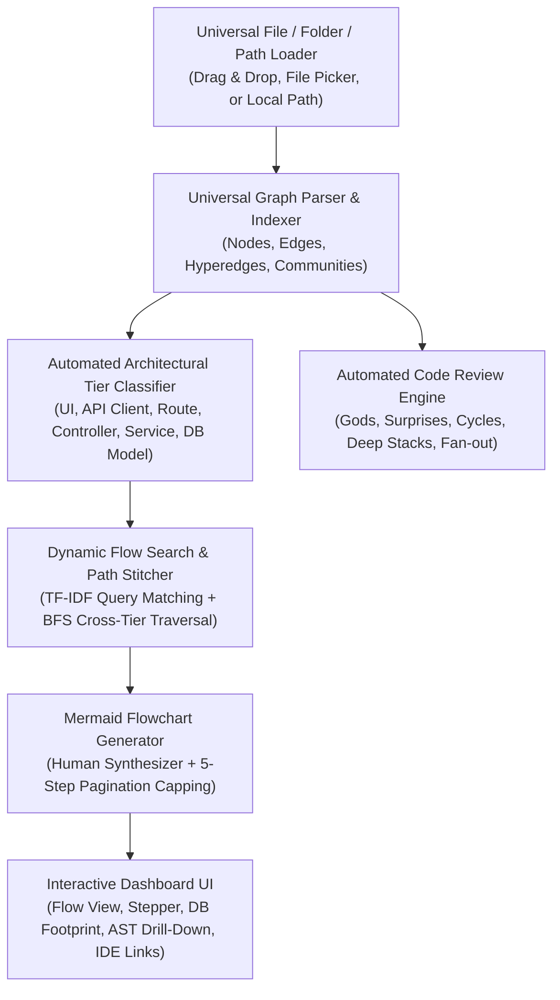

# Implementation Plan - GraphFlow-Universal (Generic Architecture & Flow Explorer)

Build **GraphFlow-Universal**, a fully generic, decoupled web dashboard designed to consume and visualize **any** standard `graph.json` and `.graphify_analysis.json` output generated by Graphify. All hardcoded project references, paths, and preset flows will be completely removed and replaced with dynamic analysis, universal path stitching, and automated architectural inference.

---

## User Review Required

> [!IMPORTANT]
> - **Zero Project Assumptions**: The app will not contain hardcoded repository paths, entity names, or hardcoded preset workflows. Any Graphify output in JavaScript, TypeScript, Python, Go, Rust, Java, C#, or PHP will be processed dynamically.
> - **Dual Loading Modes**:
>   1. **Browser-Native Mode (Zero Backend Required)**: Drag-and-drop or select `graph.json` and `.graphify_analysis.json` directly from disk; everything runs 100% client-side in memory.
>   2. **Local Repository Mode (Optional Local Server)**: Users can supply a local folder path to load graph files and read live source code files for IDE deep linking and snippet previewing.

---

## Architecture & Universal Modules

---

## Proposed Changes

### Core Services (Purely Generic & Decoupled)

#### [MODIFY] [src/services/graphParser.js](file:///d:/FreeLanceProjects/GraphifyUI/src/services/graphParser.js)
- **Universal Tier Classifier**:
  - Dynamically infers tier based on language-agnostic directory names and symbol patterns:
    - `UI_COMPONENT`: `components/`, `pages/`, `views/`, `screens/`, `templates/`, `ui/`, `frontend/`, `.jsx`, `.tsx`, `.vue`, `.svelte`, `.html`
    - `API_CLIENT`: `api/`, `client/`, `network/`, `http/`, `fetch/`, `axios/`, `sdk/`
    - `ROUTE`: `routes/`, `router/`, `endpoints/`, `handlers/`, `urls/`, `controllers/api/`
    - `CONTROLLER`: `controllers/`, `usecases/`, `actions/`, `resolvers/`, `queries/`, `mutations/`
    - `SERVICE`: `services/`, `domain/`, `core/`, `business/`, `managers/`, `utils/`, `helpers/`
    - `DB_MODEL`: `models/`, `entities/`, `schemas/`, `repositories/`, `db/`, `persistence/`, `dao/`, `migrations/`
- **Dynamic Database / Persistence Detector**:
  - Distinguishes **Reads** (`find`, `get`, `query`, `fetch`, `select`, `load`, `count`, `read`, `retrieve`) from **Writes** (`create`, `save`, `insert`, `update`, `delete`, `remove`, `adjust`, `bulk`, `mutate`, `write`, `drop`).
- **Inner AST Helper Extractor**:
  - Computes AST containment and same-file helper functions for any node dynamically via `contains`, `calls`, and `source_file` groupings.

#### [MODIFY] [src/services/humanDescriber.js](file:///d:/FreeLanceProjects/GraphifyUI/src/services/humanDescriber.js)
- Completely remove hardcoded dictionaries or project-specific text.
- Implement an automated **Natural Description Synthesizer**:
  - Analyzes verb stems (`validate`, `create`, `fetch`, `handle`, `process`, `serialize`, `render`, `convert`, `dispatch`).
  - Contextualizes with the node's architectural tier, outgoing calls, and target entities.
  - Produces human-friendly descriptions for any codebase dynamically.

#### [MODIFY] [src/services/flowTracer.js](file:///d:/FreeLanceProjects/GraphifyUI/src/services/flowTracer.js)
- Completely remove hardcoded preset flows (no product_creation, pos_checkout, etc.).
- **Dynamic Suggested Flow Generator**:
  - Automatically scans any loaded graph to discover natural workflows:
    - High-degree UI entrypoints or routes.
    - End-to-end paths traversing from Entrypoint $\rightarrow$ Controller $\rightarrow$ DB Model.
    - Generates dynamic flow suggestion chips tailored specifically to the loaded graph!
- **Dynamic Natural Language Query Matcher & Path Stitcher**:
  - Tokenizes free-form queries (e.g. *"user authentication"*, *"file upload"*, *"order payment"*, *"data sync"*).
  - Scores candidate entrypoints and terminal nodes.
  - Executes cross-tier graph traversal (BFS / shortest path across `calls`, `indirect_call`, `imports_from`, `re_exports`).
  - Emits the multi-tier flow sequence.

#### [MODIFY] [src/services/codeReviewInsights.js](file:///d:/FreeLanceProjects/GraphifyUI/src/services/codeReviewInsights.js)
- Generic bottleneck detection:
  - God objects & hubs (from `.graphify_analysis.json` gods or computed degree percentiles).
  - Cross-community architectural surprises (from `.graphify_analysis.json` surprises or cross-cluster bridge edges).
  - Circular dependency detection via Tarjan's / DFS cycle finding.
  - Deep call stack detection (> 4 hops).
  - High fan-out nodes (> 8 outgoing calls).

#### [MODIFY] [server/apiServer.js](file:///d:/FreeLanceProjects/GraphifyUI/server/apiServer.js)
- Make API server fully decoupled:
  - Support setting active repository directory dynamically via `POST /api/set-repo-path` or query param `?repoPath=...`.
  - Endpoint `POST /api/load-graph-file`: loads from any provided file path on disk.
  - Fallback to reading file snippets if a repo root is configured.

---

### UI Components

#### [MODIFY] [src/components/Navbar.jsx](file:///d:/FreeLanceProjects/GraphifyUI/src/components/Navbar.jsx)
- Display generic repository / project title (extracted from graph metadata, filename, or user input).
- Show dynamic workflow selector populated automatically from the loaded graph's discovered flows.
- "Load New Graph" button prominent in navbar with quick switcher.

#### [MODIFY] [src/components/SearchSection.jsx](file:///d:/FreeLanceProjects/GraphifyUI/src/components/SearchSection.jsx)
- Renders dynamic suggestion chips generated from the loaded graph's top discovered workflows.
- Universal search input with immediate path tracing.

#### [MODIFY] [src/components/FlowDiagram.jsx](file:///d:/FreeLanceProjects/GraphifyUI/src/components/FlowDiagram.jsx)
- Retains Mermaid flowchart rendering, 5-node pagination capping, zoom/pan controls, export SVG, copy Mermaid markup, and double-click AST drill-down.

#### [MODIFY] [src/components/NodeDetailDrawer.jsx](file:///d:/FreeLanceProjects/GraphifyUI/src/components/NodeDetailDrawer.jsx)
- Dynamic IDE link generation (`vscode://file/${repoRoot}/${source_file}:${line}`).
- Renders AST inner helper sub-graph for any selected node.

#### [MODIFY] [src/components/UploadModal.jsx](file:///d:/FreeLanceProjects/GraphifyUI/src/components/UploadModal.jsx)
- Universal loader:
  - Drag-and-drop `graph.json` and `.graphify_analysis.json`.
  - Enter local path to Graphify directory (e.g. `C:/path/to/graphify-out` or `D:/project/graphify-out`).
  - Button to "Load Built-in Sample / Demo Graph" for instant testing.

#### [NEW] [src/components/EmptyStateWelcome.jsx](file:///d:/FreeLanceProjects/GraphifyUI/src/components/EmptyStateWelcome.jsx)
- Displayed when no graph is loaded yet or user wants to start fresh.
- Guides user to drag-and-drop or select files with one-click demo option.

#### [MODIFY] [src/App.jsx](file:///d:/FreeLanceProjects/GraphifyUI/src/App.jsx)
- Dynamic state management decoupled from any hardcoded assumptions.
- Auto-detects and discovers top workflows upon graph load.

---

## Verification Plan

### Automated Tests
1. Verify `npm.cmd run build` builds the generic application cleanly.
2. Run test script verifying:
   - Dynamic tier classification against generic file paths across languages.
   - Dynamic flow discovery (discovering top 5 architectural flows from any graph).
   - Natural language path stitching for arbitrary queries.
   - 5-step pagination and expansion.
   - DB Read vs Write detection.
   - Code review insights parsing from `.graphify_analysis.json`.
3. Verify with multiple different graph files (e.g. MedStoreAI output, custom generated test graph).

### Manual Verification
1. Open `http://localhost:5180`.
2. Test drag-and-drop file upload.
3. Test local directory path loading.
4. Verify dynamic flow search with various queries.
5. Verify double-click drill-down and IDE deep linking.
